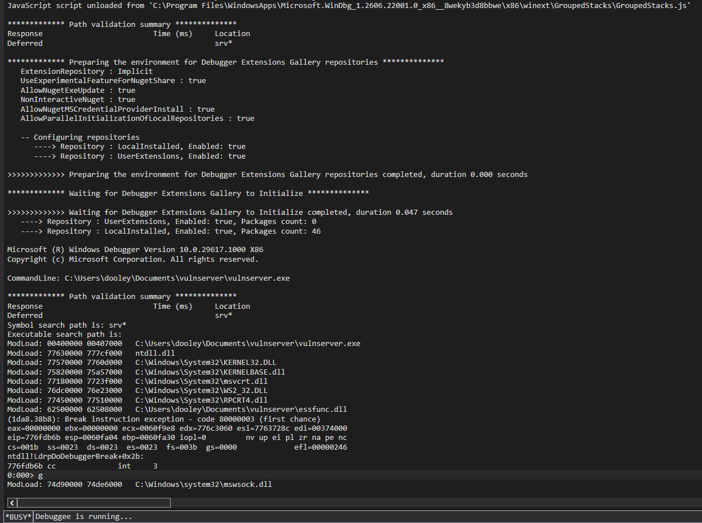

# osed-windbg

A WinDbg Preview JavaScript extension for Windows x86 exploit development. Automates the mechanical work — pattern matching, bad-char comparison, gadget scanning, format-string payload construction, shellcode encoding — so you stay focused on the exploit logic.

All commands run from the WinDbg `dx` evaluator. No Python, no external tools, no context switching.

---



## Requirements

- WinDbg Preview (WinDbgX) with DbgModel/JavaScript support
- x86 target (most commands; `sc.*` and `rop.scan/query` work on any arch)

---

## Installation

```
.scriptload C:\path\to\osed-windbg\dist\osed.js
```

Add it to your WinDbg workspace or drop it in the auto-load scripts folder to have it available on every session.

Verify:

```
dx @$osed().help()
```

---

## Quick start

```
; List all commands
dx @$osed().help()

; Detail on one command
dx @$osed().help("rop_suggest")

; Common first-session sequence
dx @$osed().triage(8000, "00 0A 0D", "essfunc", 2048)
dx @$osed().seh_ppr("libspp.dll", "00 0A 0D")
dx @$osed().rop_suggest("essfunc", 50)
```

---

## Commands

### Core

| Command | What it does |
| --- | --- |
| `help(command?)` | List commands or print the schema for one. |
| `triage(length?, badchars?, module?, stackBytes?)` | Fast crash triage: control detection, SEH chain, stack context, gadget summary. |
| `modules(filter?)` | List loaded modules with ASLR/SafeSEH/DEP/CFG state. |
| `badchars(address, exclude?)` | Compare memory against the expected byte sequence and highlight deviations. |

### Pattern / offset

```
dx @$osed().pattern_create(300)
dx @$osed().pattern_offset(0x39654138)
```

Also available as `pattern.create` / `pattern.offset`.

### SEH

```
dx @$osed().seh()             ; walk the current SEH chain
dx @$osed().seh_ppr("essfunc", "00 0A 0D")   ; find pop;pop;ret gadgets
```

### ROP gadget scanning

```
dx @$osed().rop_suggest("essfunc", 50)                       ; validated gadget set
dx @$osed().rop_suggest("essfunc", 50, true, "fast", "semantic")  ; semantic engine
dx @$osed().retn("essfunc")                                  ; retn N gadgets
dx @$osed().add_esp("essfunc")                               ; add esp, N ; ret
dx @$osed().pivots("essfunc")                                ; stack pivots
dx @$osed().find_bytes("essfunc", "FF E4")                   ; raw byte search
dx @$osed().rop_template("VirtualProtect", "essfunc")        ; PUSHAD skeleton
```

### Semantic ROP query (RP++ integration)

Paste RP++ output into `rop.scan`, then query by effect:

```
dx @$osed().rop.scan("0x10014872: pop eax ; ret ;")
dx @$osed().rop.query({ writes: ["eax"], capability: "LOAD_REGISTER" })
dx @$osed().rop.capabilities()
```

### Shellcode helpers

```
dx @$osed().egghunter("W00T", "ntaccess")
dx @$osed().encode("fc e8 82 00 00 00...", "00 0A 0D")   ; XOR encode, auto-key
dx @$osed().nop(16)
```

### Format-string namespace (`fmt`)

At a breakpoint on a `printf`-family call:

```
; 1. Find which %N$ index reaches your buffer
dx @$osed().fmt.offset(0x41414141, 40)

; 2. Build the %n write-what-where payload
dx @$osed().fmt.build(0x00402118, 0x625011AF, 6)
```

`fmt.build` outputs: chunk breakdown table, address block bytes, the format string (`%4519c%6$hn%20641c%7$hn`), a Python `struct.pack` payload, and hex. It accounts for the address-block bytes already printed before the first `%c`, which is the off-by-block error that bites you when computing padding by hand.

`width` defaults to `"word"` (`%hn`). Pass `"byte"` (`%hhn`) or `"dword"` (`%n`) as the fourth argument.

### Shellcode / PE inspection (`sc`)

Module, PE header, export enumeration, hash resolution, and IAT inspection:

```
dx @$osed().sc.modules()
dx @$osed().sc.exports("kernel32", "Virtual")
dx @$osed().sc.hash("WinExec", "ROR13")
dx @$osed().sc.hashresolve("kernel32", 0x7c0dfcaa, "ROR13")
dx @$osed().sc.iat_find("VirtualAlloc")
```

---

## Inspecting results

Every command stores its structured output. Access it after the `dx` call returns:

```
dx @$osed().last_result()
dx @$osed().last_summary()
```

---

## Building from source

```
npm install
npm run build    ; outputs dist/osed.js
npm test         ; Vitest unit suite
```

TypeScript source is in `src/`. The build produces a single self-contained JS file via esbuild — no runtime dependencies.

---

## Notes

- Most commands target x86 (cdecl/stdcall calling conventions, 4-byte pointers). `sc.*` and the semantic ROP namespace work on any architecture.
- The `encode` command supports payloads up to 65535 bytes. The XOR decoder stub is 21 bytes (≤255-byte payload) or 23 bytes (256–65535 bytes); fixed bytes in the stub are checked against the badchar list.
- `fmt.offset` reads TEB `NtTib.StackBase`/`StackLimit` for stack pointer classification; it requires an x86 target broken in at the format call site.
