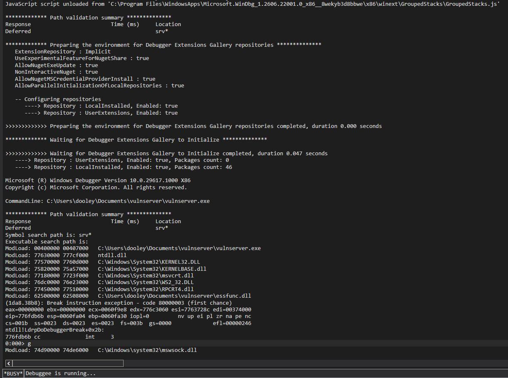

# osed-windbg

A WinDbg Preview JavaScript extension for Windows exploit development. Automates the mechanical work — pattern matching, bad-char comparison, gadget scanning, memory evidence, import/export inspection, and payload-layout math — so you stay focused on the exploit logic.

All commands run from the WinDbg `dx` evaluator. No Python, no external tools, no context switching.

See [CHANGELOG.md](CHANGELOG.md) for the reconstructed functional timeline,
including development before this project moved out of `OSED-Toolkit`.

---



## Requirements

- WinDbg Preview (WinDbgX) with DbgModel/JavaScript support
- x86 target for the full classic OSED workflow.
- x64 target for memory/landing evidence, PE/import/export helpers, math, triage context, `JMP/CALL RSP`, and x64 stack-pivot scanning.

---

## Installation

Use the included bundle if you just want to load the toolkit immediately:

```
.scriptload C:\path\to\osed-windbg\dist\osed.js
```

Add it to your WinDbg workspace or drop it in the auto-load scripts folder to have it available on every session.

Verify:

```
dx @$osed().help()
dx @$osed().version()
```

The load banner should print embedded build metadata, for example:

```text
[+] osed loaded: v1.0.4 (ebd8fe50b82c, dirty, built 2026-08-21T01:41:30.133Z)
```

If the banner or `version()` reports `dev` / `unknown`, you are not loading a properly built `dist/osed.js`.

---

## Quick start

```
; List all commands
dx @$osed().help()

; Detail on one command
dx @$osed().help("rop_suggest")

; Common first-session sequence
dx @$osed().triage(8000, "00 0A 0D", "essfunc", 2048)
dx @$osed().seh_ppr("libspp.dll", "00 0A 0D")
dx @$osed().rop_suggest("essfunc", 50)
```

---

## Commands

### Core

| Command | What it does |
| --- | --- |
| `help(command?)` | List commands or print the schema for one. |
| `triage(length?, badchars?, module?, stackBytes?)` | Fast crash triage: control detection, SEH chain, stack context, gadget summary. |
| `memory(address)` | Return normalized memory-region evidence, including tri-state access flags and raw protection metadata. |
| `can_execute(address)` | Project the normalized executable flag from `memory(address)` as `true`, `false`, or `null`. |
| `landing(address?)` | Analyze bytes and memory evidence at an address, defaulting to ESP/RSP. |
| `modules(filter?)` | List loaded modules with ASLR/SafeSEH/DEP state. |
| `badchars(address, exclude?)` | Compare memory against the expected byte sequence and highlight deviations. |

### Pattern / offset

```
dx @$osed().pattern_create(300)
dx @$osed().pattern_offset(0x39654138)
```

Also available as `pattern.create` / `pattern.offset`.

### Memory and landing evidence

```text
dx @$osed().memory(0x0012F800)
dx @$osed().can_execute(0x0012F800)
dx @$osed().landing()             ; defaults to ESP/RSP
dx @$osed().landing(0x0012F800)   ; inspect an explicit address
dx @$osed().math(0xFFFFFFD6, 32)  ; hex/signed/unsigned/LE bytes
```

`memory()` normalizes WinDbg protection metadata into `readable`, `writable`, `executable`, `guarded`, `noAccess`, `committed`, and `regionType`. Boolean fields use three states: `true`, `false`, and `null` when WinDbg cannot establish the value. Original numeric protection, state, and type values remain under `raw`.

`landing()` returns sampled bytes plus atomic observations such as NOP runs, repeated marker bytes, cyclic-pattern matches, memory permissions, disassembly status, and inaccessible or truncated ranges. These are observations, not claims that an address contains shellcode.

`triage()` consumes this same landing evidence instead of independently reading and classifying stack bytes.

`math()` formats integers as hex, signed, unsigned, little-endian bytes, and two's complement for the selected width (`8`, `16`, `32`, or `64`; default `32`).

### SEH

```
dx @$osed().seh.visualize()   ; walk the current SEH chain
dx @$osed().seh_ppr("essfunc", "00 0A 0D")   ; find pop;pop;ret gadgets
```

### ROP gadget scanning

```
dx @$osed().rop_suggest("essfunc", 50)                       ; validated gadget set
dx @$osed().rop_suggest("essfunc", 50, true, "fast", "semantic")  ; semantic engine
dx @$osed().retn("essfunc")                                  ; retn N gadgets
dx @$osed().add_esp("essfunc")                               ; add esp, N ; ret
dx @$osed().pivots("essfunc")                                ; stack pivots
dx @$osed().find_bytes("vulnserver", "FF E4")                ; module PE-section byte search
dx @$osed().find_stack_bytes("43 43 43 43")                  ; current-thread stack byte search
dx @$osed().find_mem_bytes(0x14800000, 0x16000, "43 43 43 43") ; explicit live-memory range search
dx @$osed().rop_template("VirtualProtect", "essfunc")        ; PUSHAD skeleton
```

`find_bytes(module, ...)` searches PE sections in the named loaded module. By default it searches executable sections only, which makes it useful for gadget hunting and opcode checks in module-backed memory.

`find_stack_bytes(bytes, ...)` searches the current thread stack starting at `ESP`/`RSP`. It does not search the heap or arbitrary process memory.

`find_mem_bytes(address, length, bytes, ...)` searches an explicit readable memory range that you provide. Use it for stack, heap, mapped regions, or module-backed memory when you already know the address window you want to inspect.

Use `findmsp()` when you need cyclic-pattern offsets, `find_bytes()` when you need module/image byte hits, `find_stack_bytes()` when you need to confirm that live input bytes landed on the current stack, and `find_mem_bytes()` when you need an explicit live-memory range search.

### Semantic ROP pipeline

The semantic pipeline takes you from raw gadgets to a concrete stack layout in five stages: **scan** → **plan** → **emit** → **synthesize** → **export**.

#### 1. Scan — build the corpus

Load gadgets from RP++ text or live target memory. Both paths accept badchars to filter gadgets whose addresses contain prohibited bytes.

```
; From RP++ output
dx @$osed().rop.scan(rpOutput, "00 0A 0D")

; From live target memory (discovers gadgets in-process)
dx @$osed().rop.scan_live("essfunc", "00 0A 0D")
dx @$osed().rop.scan_live(["essfunc", "compression"], "00 0A 0D")

; Query and inspect the corpus
dx @$osed().rop.query("capability", "LOAD_REGISTER")
dx @$osed().rop.capabilities()
```

#### 2. Plan — choose a strategy

Plans feasible exploit strategies from semantic capabilities. Reports feasibility, preconditions, and recommended approaches.

```
dx @$osed().rop.plan("VirtualProtect")
dx @$osed().rop.plan("VirtualAlloc", "iat")
dx @$osed().rop.plan("WriteProcessMemory")
```

Each plan gets an ID for use in later stages.

#### 3. Emit — assign concrete gadgets

Selects and ranks concrete gadgets for a planned strategy. Produces a gadget assignment, not an executable chain.

```
dx @$osed().rop.emit(1)          ; emit for plan 1
dx @$osed().rop.emit(1, 3)       ; emit for plan 1, strategy 3
```

#### 4. Synthesize — produce a stack layout

Combines a plan with the current exploit state (crash geometry, registers, constraints) to produce a concrete stack layout. The exploit state is populated automatically by `triage()` or set manually with `exploit.state()`.

```
dx @$osed().triage(8000, "00 0A 0D")     ; auto-populates exploit state
dx @$osed().rop.synthesize(1)
dx @$osed().rop.synthesize(1, {controlledBytesAfterEsp: 512})
```

Three entry paths are evaluated in order: RET_TO_FRAME (ret gadget in saved EIP), DIRECT_API (API address in saved EIP), PIVOT_TO_FRAME (stack pivot).

Status is one of: `complete`, `complete-with-violations` (layout produced but a concrete value contains a badchar), or `blocked` (structural impossibility).

#### 5. Export — write a Python exploit stub

Exports the emitted gadgets and (if available) the synthesized stack layout as a Python script with `struct.pack` lines and semantic comments.

```
dx @$osed().rop.export(1)                            ; print to console
dx @$osed().rop.export(1, "C:\\exploit\\rop.py")      ; write to file
```

#### Pivot finder

Finds, classifies, and ranks stack pivot gadgets from the corpus. Pivots are classified as `register` (xchg/mov esp), `esp-adjust` (add/sub esp), or `memory` (indirect).

```
dx @$osed().rop.pivots()                ; all pivots
dx @$osed().rop.pivots("eax")           ; only pivots sourced from EAX
dx @$osed().rop.pivots(undefined, 0x100) ; only esp-adjust with delta >= 0x100
```

#### Flat frame builders

Build stdcall API frames directly — no ROP gadgets needed. Useful with RET_TO_FRAME or DIRECT_API entry paths.

```
dx @$osed().rop.frame_vp(0x7C801AD0, 0x625011AF, 0x0012F800, 0x201, 0x40, 0x62506000, "00 0A 0D")
dx @$osed().rop.frame_wpm(0x7C802213, 0x625011AF, 0xFFFFFFFF, 0x62502000, 0x0012F800, 0x200)
dx @$osed().rop.frame_va(0x7C809AE1)
```

#### Legacy PUSHAD chain builders

Build register-setup chains that end with PUSHAD. These operate independently of the planner and are the classic OSED approach.

```
dx @$osed().rop.chain_vp(0x7C801AD0, 0x62501010, 0x625011AF)
dx @$osed().rop.chain_wpm(0x7C802213, 0x625011AF, 0x0012F800, 0x200)
dx @$osed().rop.chain_va(0x7C809AE1)
dx @$osed().rop.chain("eax", 0xDEADBEEF, "ebx", 0x1000)
```

### Exploit state (`exploit`)

The exploit state captures crash geometry — control mechanism, stack layout, register values, and constraints. It is populated automatically by `triage()` and consumed by `rop.synthesize()`.

```
dx @$osed().exploit.state()              ; view current state
dx @$osed().exploit.state({mechanism: "saved-ret", controlledBytesAfterEsp: 512})
dx @$osed().exploit.state({badchars: "00 0A 0D", apiResolution: "iat"})
dx @$osed().exploit.clear()              ; reset
```

You can set or override any field without rerunning triage. This is useful when the debugger has continued past the crash point, or when you want to model a different scenario.

### Shellcode helpers

```
dx @$osed().egghunter("W00T", "ntaccess")
dx @$osed().encode("fc e8 82 00 00 00...", "00 0A 0D")   ; XOR encode, auto-key
dx @$osed().nop(16)
```

### String helpers (`str`)

Read strings, search module sections, and convert text into payload bytes:

```
dx @$osed().str.read(0x0019F920)
dx @$osed().str.find("VirtualProtect", "target", "both", 25)
dx @$osed().str.refs("VirtualProtect", "target", "both", 25)
dx @$osed().str.bytes("cmd.exe", "ascii", true, "00 0A 0D")
```

### Format-string namespace (`fmt`)

At a breakpoint on a `printf`-family call:

```
; 1. Find which %N$ index reaches your buffer
dx @$osed().fmt.offset(0x41414141, 40)

; 2. Build the %n write-what-where payload
dx @$osed().fmt.build(0x00402118, 0x625011AF, 6)
```

`fmt.build` outputs: chunk breakdown table, address block bytes, the format string (`%4519c%6$hn%20641c%7$hn`), a Python `struct.pack` payload, and hex. It accounts for the address-block bytes already printed before the first `%c`, which is the off-by-block error that bites you when computing padding by hand.

`width` defaults to `"word"` (`%hn`). Pass `"byte"` (`%hhn`) or `"dword"` (`%n`) as the fourth argument.

### Shellcode / PE inspection (`sc`)

Module, PE header, export enumeration, hash resolution, and IAT inspection:

```
dx @$osed().sc.modules()
dx @$osed().sc.exports("kernel32", "Virtual")
dx @$osed().sc.hash("WinExec", "ROR13")
dx @$osed().sc.hashresolve("kernel32", 0x7c0dfcaa, "ROR13")
dx @$osed().sc.iat_find("VirtualAlloc")
```

---

## Inspecting results

Every command stores its structured output. Access it after the `dx` call returns:

```
dx @$osed().last_result()
dx @$osed().last_summary()
```

`memory()` returns its evidence object directly. `landing()` returns debugger-friendly observation rows; its complete evidence remains available through `last_result()`. `can_execute()` returns `true`, `false`, or `null`; it does not issue an independent query path beyond normalized memory evidence.

---

## Building from source

If you do not want to use the checked-in `dist/osed.js`, build your own copy locally.
This repo pins package versions in `package.json`, but does not commit `node_modules` or `package-lock.json`.

```
npm install
npm run build
```

That writes a fresh bundle to `dist/osed.js`.

Verify the build:

```
npm test
```

Then verify the loaded bundle in WinDbg:

```text
.scriptload C:\path\to\osed-windbg\dist\osed.js
dx @$osed().version()
```

TypeScript source is in `src/`. The build produces a single self-contained JS file via esbuild — no runtime dependencies.

---

## Notes

- Classic SEH, PPR, format-string offset mapping, PUSHAD ROP templates, and semantic ROP scoring remain x86-oriented.
- x64 support is evidence-first: register naming, pointer formatting, memory permissions, landing analysis, `JMP/CALL RSP`, and RSP pivot byte-pattern scans. The semantic ROP backend is still x86-only; x64 `rop_suggest(..., "semantic")` falls back to the x64 byte-pattern scanner with a warning.
- The `encode` command supports payloads up to 65535 bytes. The XOR decoder stub is 21 bytes (≤255-byte payload) or 23 bytes (256–65535 bytes); fixed bytes in the stub are checked against the badchar list.
- `fmt.offset` reads TEB `NtTib.StackBase`/`StackLimit` for stack pointer classification; it requires an x86 target broken in at the format call site.
